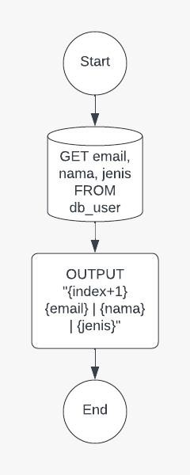

# CHALLENGE KELOMPOK ALGORITMA PEMROGRAMAN TEORI

## Kelompok 5 :

1. Muhammad Ali Pratama Putra (5220411416)

2. Jati Kurniawan (5220411448) 

3. Diki Hendrik Setyawan (5220411435)

# Overview

> Kami membuat program aplikasi to-do list sehari-hari yang kami beri
> nama "Aplikasi Catat.". Pada project ini, kami menggunakan mekanisme
> program modular dan sedikit implementasi OOP (object oriented
> programming) pada kasus koneksi database. Untuk actor dari aplikasi
> ini terdapat 2 akses, yaitu admin dan user. Pada dasarnya, aplikasi
> ini bertujuan untuk memanajemen task/pekerjaan. Aplikasi ini dapat
> menerapkan implementasi CRUD (Create, Update, Update, and Delete) pada
> beberapa task yang disimpan di database server, menerapkan filter data
> berdasarkan tanggal, melakukan sorting data (disini kami memakai
> algoritma bubble sort), menampilkan menu CLI(Command Line Interface)
> dengan penerapan while loop, dan melakukan enkripsi data menggunakan
> metode assymetric encryption.
>
> Berikut adalah use case UML diagram nya:

> Berikut adalah beberapa flowchart sederhana dari sub program:
>
> *(implementasi materi week 2)*

> 
> 
> 

B.  # Penyusun Aplikasi

    -   **Library** *(implementasi materi week 10)*

> Kami menggunakan beberapa library, diantaranya:

1.  Library Built-in untuk menggunakan fungsi dasar bawaan python.

2.  Library Os untuk merapihkan menu CLI (Command Line Interface).

3.  Library Datetime untuk mengatur waktu.

4.  Library mysql.connector untuk menyambungkan database server.

5.  Library cryptography.fernet untuk enkripsi dan dekripsi data string.

    -   **Sub Program** *(implementasi materi week 6)*

> Aplikasi ini terdiri dari 22 sub program (10 fungsi non-parameter dan
> 12 fungsi berparameter), 1 class untuk session berisikan 4 atribut dan
> 2 method.

-   Struktur Database *(implementasi materi week 12)*

> 
> Tabel db_user
>
> 
> Tabel db_task

-   Tampilan Database pada phpMyAdmin *(implementasi materi week 12)*

> Tabel db_user
>
> 
>
> 
> Tabel db_task

# Output (Keluaran)

1.  ## Output User

    -   Menu awal:

> 
>
> User melakukan login terlebih dahulu

-   User dapat mengubah password dengan memilih no 1

> 

-   Setelah login layar akan menampilkan beberapa menu.

> 

-   Jika user memilih no 2 maka tampilan akan seperti ini

> 
>
> User dapat menambahkan task seperti diatas.

-   Jika user memilih no 3 maka akan sepeti berikut

> 
>
> User dapat memilih tampilan task seperti berikut:

-   Jika user memeilih no 1 maka:

-   Jika user memilih no 2 maka:

-   Jika user memilih no 3 maka:

-   User juga dapat mengedit tasknya dengan memilih no 4

-   User juga dapat menghapus task dengan memilih no 5

> 

-   Keluar dengan memilih no 0

> 

2.  ## Output Admin

    -   Ini adalah tampilan menu dari admin

> 

-   Admin dapat melihat semua akun dengan memilih no 1

> 

-   Admin juga dapat membuat akun baru dengan memilih no 2

> 

-   Admin juga dapat mengubah password dengan memilih no 3

> 

-   Admin juga dapat menghapus akun dengan memilih no 4

> 

-   Keluar dengan memilih no 0

> 
